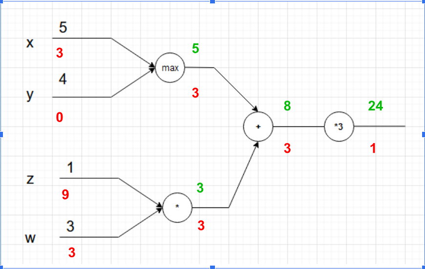

# Examen Abril - SAA

## 0. Importante para el examen

### 0.1 Código para las Gráficas

```python
# Definición de funciones que permitirán la visualización de las graficas de entrenamiento
def plot_acc(history, title="Model Accuracy"):
    """Imprime una gráfica mostrando la accuracy por epoch obtenida en un entrenamiento"""
    plt.plot(history.history['accuracy'])
    plt.plot(history.history['val_accuracy'])
    plt.title(title)
    plt.ylabel('Accuracy')
    plt.xlabel('Epoch')
    plt.legend(['Entrenamiento', 'Validación'], loc='upper left')
    plt.show()

def plot_loss(history, title="Model Loss"):
    """Imprime una gráfica mostrando la pérdida por epoch obtenida en un entrenamiento"""
    plt.plot(history.history['loss'])
    plt.plot(history.history['val_loss'])
    plt.title(title)
    plt.ylabel('Loss')
    plt.xlabel('Epoch')
    plt.legend(['Entrenamiento', 'Validación'], loc='upper right')
    plt.show()

def plot_compare_losses(history1, history2, name1="Red 1",
                        name2="Red 2", title="Graph title"):
    """Compara losses de dos entrenamientos con nombres name1 y name2"""
    plt.plot(history1.history['loss'], color="green")
    plt.plot(history1.history['val_loss'], '--', color="green")
    plt.plot(history2.history['loss'], color="blue")
    plt.plot(history2.history['val_loss'], '--', color="blue")
    plt.title(title)
    plt.ylabel('Loss')
    plt.xlabel('Epoch')
    plt.legend(['Entrenamiento ' + name1, 'Validación ' + name1,
                'Entrenamiento ' + name2, 'Validación ' + name2],
               loc='upper right')
    plt.show()

def plot_compare_accs(history1, history2, name1="Red 1",
                      name2="Red 2", title="Graph title"):
    """Compara accuracies de dos entrenamientos con nombres name1 y name2"""
    plt.plot(history1.history['accuracy'], color="green")
    plt.plot(history1.history['val_accuracy'], '--', color="green")
    plt.plot(history2.history['accuracy'], color="blue")
    plt.plot(history2.history['val_accuracy'], '--', color="blue")
    plt.title(title)
    plt.ylabel('Accuracy')
    plt.xlabel('Epoch')
    plt.legend(['Train ' + name1, 'Val ' + name1,
                'Train ' + name2, 'Val ' + name2],
               loc='lower right')
    plt.show()
```

### 0.2 Tabla Registro de Experimentos

```python
from prettytable import PrettyTable

def registrar_experimento(tabla, history_obj, nombre_exp, descripcion):
    """
    Extrae los mejores resultados de un objeto history de Keras,
    los añade a la tabla y la imprime.
    """
    # 1. Encontrar el índice de la época con el mejor validation accuracy
    # Usamos .history['val_accuracy'] que es la lista de métricas por época
    indice_mejor_val_acc = np.argmax(history_obj.history['val_accuracy'])

    # 2. Extraer los valores de esa época específica
    acc = history_obj.history['accuracy'][indice_mejor_val_acc]
    loss = history_obj.history['loss'][indice_mejor_val_acc]
    val_acc = history_obj.history['val_accuracy'][indice_mejor_val_acc]
    val_loss = history_obj.history['val_loss'][indice_mejor_val_acc]

    # 3. Añadir la fila a la tabla redondeando a 4 decimales
    tabla.add_row([
        nombre_exp,
        descripcion,
        f"{acc:.4f}",
        f"{loss:.4f}",
        f"{val_acc:.4f}",
        f"{val_loss:.4f}"
    ])

    # 4. Imprimir la tabla actualizada
    print(tabla)
```

```python
# Inicializas la tabla
mi_tabla = PrettyTable(["Experimento", "Descripción", "Accuracy", "Loss", "Val_Accuracy", "Val_Loss"])
```

```python
# 1. Registrar el Experimento 1 en la tabla
registrar_experimento(mi_tabla,
                      history,
                      "Experimento 1",
                      "CNN Básica (32-64 filtros) con Dropout 0.3")

```

## 1. Arquitectura de Entrenamientos de Redes Neuronales

### 1.1 Tabla resumen rápido (tipo examen)

| Pregunta del examen                  | Respuesta clave                                                            |
| :----------------------------------- | :------------------------------------------------------------------------- |
| ¿Qué tipo de red para imágenes?      | CNN — preserva estructura espacial, eficiente en parámetros                |
| ¿Capa de salida para N clases (N>2)? | `Dense(N, activation='softmax')`                                           |
| ¿Capa de salida para 2 clases?       | `Dense(1, activation='sigmoid')`                                           |
| ¿Loss para etiquetas enteras?        | `sparse_categorical_crossentropy`                                          |
| ¿Loss para one-hot encoding?         | `categorical_crossentropy` (usar `to_categorical(y, N)`)                   |
| ¿Loss para clasificación binaria?    | `binary_crossentropy`                                                      |
| ¿Parámetros de MaxPooling?           | 0 parámetros entrenables                                                   |
| ¿Por qué falla init a cero?          | Problema de simetría: neuronas idénticas → no aprenden                     |
| ¿Qué hace Dropout?                   | Regularización: apaga neuronas aleatoriamente en entrenamiento             |
| ¿Qué hace BatchNormalization?        | Normaliza activaciones entre capas → estabiliza y acelera                  |
| ¿Qué hace EarlyStopping?             | Para el entrenamiento si `val_accuracy` no mejora en N epochs              |
| ¿Reshape para CNN en Keras?          | `(batch, H, W, canales)` — añadir dimensión de canal                       |
| ¿SGD o ADAM?                         | ADAM converge más rápido pero usa ~3x memoria. SGD puede generalizar mejor |
| ¿Normalización de imágenes?          | `x_train = x_train.astype('float32') / 255.0`                              |
| ¿Cómo detectar sesgo?                | `np.unique(y_train, return_counts=True)` → verificar balance de clases     |

---

### 1.2 ¿Por qué usar CNNs para imágenes?

Se elige una **Red Neuronal Convolucional (CNN)** en lugar de un MLP (Perceptrón Multicapa) por:

1. **Preservación de la estructura espacial**: Un MLP aplana la imagen inmediatamente, destruyendo la información espacial (qué píxeles están al lado de cuáles). Las CNN analizan la imagen en 2D y detectan patrones locales.
2. **Eficiencia de parámetros (Parameter Sharing)**: Los filtros se deslizan por toda la imagen → muchos menos pesos entrenables que una capa densa completa. Modelo más rápido y menos propenso al overfitting.
3. **Invarianza a la traslación**: El `MaxPooling` reduce la dimensionalidad y permite reconocer un objeto independientemente de su posición en la imagen.
4. **Extracción jerárquica de características**: Las primeras capas detectan bordes, las intermedias texturas, y las profundas formas complejas.

---

### 1.3 Patrón arquitectónico estándar de CNN

```
# Bloque convolucional (repetir N veces, aumentando filtros)
Conv2D(filtros, kernel, relu) → [BatchNorm →] MaxPool(2×2) →

# Clasificador
Flatten → Dense(N, relu) → [BatchNorm →] Dropout(0.3) → Dense(clases, softmax)
```

**Ejemplo típico (Fashion-MNIST / CIFAR-10):**

```python
model = Sequential([
    Conv2D(32, (3,3), activation='relu', input_shape=(28,28,1)),
    MaxPooling2D((2,2)),
    Conv2D(64, (3,3), activation='relu'),
    MaxPooling2D((2,2)),
    Flatten(),
    Dense(128, activation='relu'),
    Dropout(0.3),
    Dense(10, activation='softmax')
])
```

**Con BatchNormalization:**

```python
model = Sequential([
    Conv2D(32, (3,3), activation='relu'),
    BatchNormalization(),
    MaxPooling2D((2,2)),
    Conv2D(64, (3,3), activation='relu'),
    BatchNormalization(),
    MaxPooling2D((2,2)),
    Flatten(),
    Dense(128, activation='relu'),
    BatchNormalization(),
    Dropout(0.3),
    Dense(10, activation='softmax')
])
```

---

### 1.4 Optimizadores: SGD vs ADAM

| Aspecto                          | SGD                  | ADAM                                      |
| :------------------------------- | :------------------- | :---------------------------------------- |
| **Velocidad convergencia**       | Lenta                | Rápida                                    |
| **Memoria por parámetro**        | 1x (solo el peso)    | ~3x (peso + 2 momentos)                   |
| **Resultado en pocas epochs**    | Inferior             | Superior                                  |
| **Generalización a largo plazo** | Potencialmente mejor | Puede sobreajustar                        |
| **Parámetros almacenados**       | `W`                  | `W`, `m` (1er momento), `v` (2do momento) |

**Ejemplo práctico (Examen 2023, CIFAR-10, 5 epochs, misma arquitectura):**

- SGD → val_accuracy: **61.15%**
- ADAM → val_accuracy: **67.01%**

> **Concepto clave de examen**: Mismos parámetros entrenables (160,650), pero ADAM almacena 2 momentos adicionales por parámetro → total ~482,400 valores en memoria (el triple).

---

### 1.5 BatchNormalization (BN)

- **Qué hace**: Normaliza las activaciones de cada capa durante el entrenamiento (media ≈ 0, varianza ≈ 1).
- **Efecto**: Estabiliza el entrenamiento, permite learning rates más altos, actúa como regularizador ligero.
- **Posición**: Después de `Conv2D` / `Dense` y antes de `MaxPool` / `Dropout`.
- **Con SGD**: BN acelera especialmente la convergencia de SGD.

**Pattern**: `Conv → BN → Pool` y `Dense → BN → Dropout`

---

### 1.6 Dropout (Regularización)

- **Qué hace**: Durante el entrenamiento, desactiva aleatoriamente un porcentaje de neuronas en cada iteración.
- **Propósito**: Prevenir overfitting (fuerza a la red a no depender de neuronas individuales).
- **No actúa en inferencia** (solo en `model.fit`, no en `model.predict`).

| Dropout Rate | Efecto                                                          |
| :----------- | :-------------------------------------------------------------- |
| 0.3          | Buen equilibrio regularización/accuracy                         |
| 0.5          | Más agresivo → reduce más overfitting pero puede bajar accuracy |

**Ejemplo práctico (Examen 2024, Fashion-MNIST):**

- Dropout 0.3 → val_accuracy: **91.68%**
- Dropout 0.5 → val_accuracy: **90.12%** (accuracy un poco menor, más regularización)

---

### 1.7 Data Augmentation (ImageDataGenerator)

Genera variaciones artificiales de las imágenes de entrenamiento para aumentar la diversidad del dataset.

```python
from keras.preprocessing.image import ImageDataGenerator

datagen = ImageDataGenerator(
    rotation_range=10,
    zoom_range=0.1,
    width_shift_range=0.1,
    height_shift_range=0.1,
    horizontal_flip=True
)

# Entrenar con data augmentation:
history = model.fit(datagen.flow(x_train, y_train, batch_size=64),
                    epochs=15, validation_data=(x_test, y_test))
```

- **Ventaja**: Previene overfitting, especialmente útil en datasets pequeños.
- **Desventaja a corto plazo**: Puede reducir accuracy inicialmente (necesita más epochs para converger).

---

### 1.8 EarlyStopping

Detiene el entrenamiento automáticamente cuando la métrica de validación deja de mejorar.

```python
from keras.callbacks import EarlyStopping

early_stop = EarlyStopping(
    monitor='val_accuracy',  # o 'val_loss'
    patience=3,              # epochs sin mejora antes de parar
    restore_best_weights=True  # restaura los pesos del mejor epoch
)

history = model.fit(x_train, y_train, epochs=30,
                    validation_data=(x_test, y_test),
                    callbacks=[early_stop])
```

---

### 1.9 Funciones de pérdida (Loss)

| Loss                              | Cuándo usar                      | Etiquetas                          |
| :-------------------------------- | :------------------------------- | :--------------------------------- |
| `sparse_categorical_crossentropy` | Clasificación multiclase         | Enteras: `[0, 3, 7, 2, ...]`       |
| `categorical_crossentropy`        | Clasificación multiclase         | One-hot: `[[1,0,0], [0,1,0], ...]` |
| `binary_crossentropy`             | Clasificación binaria (2 clases) | Binarias: `[0, 1, 1, 0, ...]`      |

> **Para usar `categorical_crossentropy`**: `y_train = to_categorical(y_train, num_classes)`

---

### 1.10 ⚠️ Inicialización a CERO — Rompe el aprendizaje

```python
from keras.initializers import Zeros

# ❌ NUNCA hacer esto:
Dense(128, activation='relu', kernel_initializer=Zeros(), bias_initializer=Zeros())
```

**Resultado**: El modelo no aprende (accuracy ~10% para 10 clases = aleatorio puro).

**¿Por qué?** → **Problema de ruptura de simetría**:

- Si todos los pesos empiezan en 0, todas las neuronas de una capa producen la misma salida.
- Los gradientes son idénticos para todas → actualizan igual → permanecen iguales.
- La red NUNCA puede romper esta simetría → no aprende.

> **En examen**: La inicialización a cero tiene más impacto negativo que añadir capas convolucionales extra.

---

### 1.11 Normalización de datos

```python
# Escalar píxeles de [0, 255] a [0, 1]
x_train = x_train.astype('float32') / 255.0
x_test = x_test.astype('float32') / 255.0
```

**¿Por qué?** Los píxeles originales tienen valores 0–255. Normalizar a [0,1] mejora la convergencia del optimizador y la estabilidad numérica.

---

### 1.12 Análisis de sesgo del dataset

```python
# Verificar distribución de clases
unique, counts = np.unique(y_train, return_counts=True)
# Si todas las clases tienen ≈ mismo count → dataset balanceado → no hay sesgo
```

**Ejemplo**: Fashion-MNIST tiene 6000 muestras por clase → **balanceado** (sin sesgo).

---

### 1.13 Compilación y entrenamiento típico

```python
# Compilación
model.compile(
    optimizer='adam',                        # o 'sgd'
    loss='sparse_categorical_crossentropy',  # etiquetas enteras
    metrics=['accuracy']
)

# Entrenamiento con datos de validación
history = model.fit(
    x_train, y_train,
    epochs=15,
    batch_size=64,
    validation_split=0.2,       # 20% del train como validación
    # O: validation_data=(x_test, y_test),
    callbacks=[early_stop]
)
```

---

### 1.14 Tabla comparativa de experimentos (referencia de exámenes)

| Dataset       | Arquitectura                                                                          | Optimizer | val_accuracy | Notas                       |
| :------------ | :------------------------------------------------------------------------------------ | :-------- | :----------- | :-------------------------- |
| CIFAR-10      | Conv(32)→BN→Pool→Conv(64)→BN→Pool→Conv(128)→BN→Pool→Dense(128)→Drop(0.3)→Dense(10)    | SGD       | 61.15%       | 5 epochs, lento             |
| CIFAR-10      | (misma)                                                                               | ADAM      | 67.01%       | 5 epochs, más rápido        |
| Fashion-MNIST | Conv(32)→Pool→Conv(64)→Pool→Dense(128)→Drop(0.3)→Dense(10)                            | ADAM      | 91.68%       | 13 eps (EarlyStopping)      |
| Fashion-MNIST | (misma con Drop 0.5)                                                                  | ADAM      | 90.12%       | Más regularización          |
| Fashion-MNIST | (misma)                                                                               | SGD       | 88.90%       | Convergencia más lenta      |
| Fashion-MNIST | (con BN)                                                                              | ADAM      | 91.41%       | BN estabiliza               |
| Fashion-MNIST | (con BN + Augment)                                                                    | ADAM      | 90.30%       | Augment necesita más epochs |
| Fashion-MNIST | Conv(32)→Pool→Conv(64)→Pool→Conv(128,same)→Dense(128,**init=0**)→Dense(10,**init=0**) | ADAM      | **10.00%**   | ❌ Init cero rompe todo     |

## 2. Ejercicio de Backpropagation

### Operaciones elementales en Backpropagation

| Operación      | Símbolo | Forward Pass (Valor) | Backward Pass (Gradiente)                                 | "El truco"                                                                       |
| -------------- | ------- | -------------------- | --------------------------------------------------------- | -------------------------------------------------------------------------------- |
| Suma           | `+`     | $a + b$              | Pasa el gradiente igual a ambas entradas.                 | **El Distribuidor:** No cambia el gradiente, lo copia.                           |
| Multiplicación | `*`     | $a \times b$         | El gradiente de una es el valor de la otra (intercambio). | **El Intercambiador:** Multiplica el gradiente que llega por la "otra" variable. |
| Máximo         | `max`   | $\max(a, b)$         | Pasa el gradiente completo al mayor; $0$ al menor.        | **El Router:** Solo deja pasar el gradiente por el camino que "ganó".            |
| Escalar        | `* k`   | $x \times k$         | Multiplica el gradiente por la constante $k$.             | **El Amplificador:** Escala el gradiente según el número.                        |



## 3. Ejercicio de Redes Neuronales Convolucionales

### Fórmulas de referencia

$$W_{out} = \frac{W_{in} - F + 2P}{S} + 1$$

$$\text{Params} = (F \times F \times C_{in} + 1) \times K$$

| Variable | Significado                               |
| -------- | ----------------------------------------- |
| $W_{in}$ | Ancho / alto de entrada                   |
| $F$      | Tamaño del filtro                         |
| $P$      | Padding                                   |
| $S$      | Stride                                    |
| $C_{in}$ | Canales de entrada (ej. 3 para RGB)       |
| $K$      | Número de filtros (profundidad de salida) |

> **Regla de oro:** si $W_{out}$ no es un número entero → stride incompatible → configuración inválida.

> **Max Pooling:** nunca tiene parámetros (0). La profundidad $D$ siempre se conserva igual a la entrada.

#### Ejercicio 1

**Input:** $32 \times 32 \times 3$ — 10 filtros de $6 \times 6$, stride $S=1$, padding $P=2$

**Volumen de salida:** $31 \times 31 \times 10$  
**Número de parámetros:** $1090$

**Cálculo:**

$$W = \frac{32 - 6 + 2 \times 2}{1} + 1 = \frac{30}{1} + 1 = 30 + 1 = 31$$

$$H = \text{imagen cuadrada} \Rightarrow H_{out} = 31 \qquad D = K = 10$$

$$\text{Params} = (6 \times 6 \times 3 + 1) \times 10 = 109 \times 10 = 1090$$

---

#### Ejercicio 2

**Input:** $32 \times 32 \times 3$ — 10 filtros de $6 \times 6$, stride $S=2$, padding $P=2$

**Volumen de salida:** $16 \times 16 \times 10$  
**Número de parámetros:** $1090$

**Cálculo:**

$$W = \frac{32 - 6 + 2 \times 2}{2} + 1 = \frac{30}{2} + 1 = 15 + 1 = 16$$

$$H = \text{imagen cuadrada} \Rightarrow H_{out} = 16 \qquad D = K = 10$$

$$\text{Params} = (6 \times 6 \times 3 + 1) \times 10 = 109 \times 10 = 1090$$

---

#### Ejercicio 3

**Input:** $32 \times 32 \times 3$ — 10 filtros de $6 \times 6$, stride $S=3$, padding $P=2$

**Volumen de salida:** $11 \times 11 \times 10$  
**Número de parámetros:** $1090$

**Cálculo:**

$$W = \frac{32 - 6 + 2 \times 2}{3} + 1 = \frac{30}{3} + 1 = 10 + 1 = 11$$

$$H = \text{imagen cuadrada} \Rightarrow H_{out} = 11 \qquad D = K = 10$$

$$\text{Params} = (6 \times 6 \times 3 + 1) \times 10 = 109 \times 10 = 1090$$

---

#### Ejercicio 4 ⚠️ Stride incompatible

**Input:** $32 \times 32 \times 3$ — 10 filtros de $6 \times 6$, stride $S=4$, padding $P=2$

**Volumen de salida:** ❌ Inválido  
**Número de parámetros:** $1090$ (los parámetros se calculan igual, pero la capa no es aplicable)

**Cálculo:**

$$W = \frac{32 - 6 + 2 \times 2}{4} + 1 = \frac{30}{4} + 1 = 7{,}5 + 1 = 8{,}5 \quad \Rightarrow \text{No entero: Inválido}$$

---

#### Ejercicio 5 ⚠️ Stride incompatible

**Input:** $32 \times 32 \times 3$ — 10 filtros de $5 \times 5$, stride $S=2$, padding $P=2$

**Volumen de salida:** ❌ Inválido  
**Número de parámetros:** $760$ (calculable pero la capa no es aplicable)

**Cálculo:**

$$W = \frac{32 - 5 + 2 \times 2}{2} + 1 = \frac{31}{2} + 1 = 15{,}5 + 1 = 16{,}5 \quad \Rightarrow \text{No entero: Inválido}$$

$$\text{Params} = (5 \times 5 \times 3 + 1) \times 10 = 76 \times 10 = 760$$

---

### Capas de Max Pooling

> En Max Pooling: **no hay parámetros** y la profundidad $D$ **se conserva** siempre.

> Se usa $P = 0$ por defecto (sin padding).

---

#### Ejercicio 6 ⚠️ Stride incompatible

**Input:** $224 \times 224 \times 64$ — filtro $6 \times 6$, stride $S=5$

**Volumen de salida:** ❌ Inválido  
**Parámetros:** $0$

$$W = \frac{224 - 6 + 0}{5} + 1 = \frac{218}{5} + 1 = 43{,}6 + 1 = 44{,}6 \quad \Rightarrow \text{No entero: Inválido}$$

---

#### Ejercicio 7

**Input:** $224 \times 224 \times 64$ — filtro $2 \times 2$, stride $S=1$

**Volumen de salida:** $223 \times 223 \times 64$  
**Parámetros:** $0$

$$W = \frac{224 - 2 + 0}{1} + 1 = \frac{222}{1} + 1 = 222 + 1 = 223$$

$$H = \text{imagen cuadrada} \Rightarrow H_{out} = 223 \qquad D = 64 \text{ (se conserva)}$$

---

#### Ejercicio 8 ⚠️ Stride incompatible

**Input:** $224 \times 224 \times 64$ — filtro $113 \times 113$, stride $S=2$

**Volumen de salida:** ❌ Inválido  
**Parámetros:** $0$

$$W = \frac{224 - 113 + 0}{2} + 1 = \frac{111}{2} + 1 = 55{,}5 + 1 = 56{,}5 \quad \Rightarrow \text{No entero: Inválido}$$

---

#### Ejercicio 9

**Input:** $224 \times 224 \times 64$ — filtro $4 \times 4$, stride $S=2$

**Volumen de salida:** $111 \times 111 \times 64$  
**Parámetros:** $0$

$$W = \frac{224 - 4 + 0}{2} + 1 = \frac{220}{2} + 1 = 110 + 1 = 111$$

$$H = \text{imagen cuadrada} \Rightarrow H_{out} = 111 \qquad D = 64 \text{ (se conserva)}$$

---

#### Ejercicio 10

**Input:** $224 \times 224 \times 64$ — filtro $112 \times 112$, stride $S=4$

**Volumen de salida:** $29 \times 29 \times 64$  
**Parámetros:** $0$

$$W = \frac{224 - 112 + 0}{4} + 1 = \frac{112}{4} + 1 = 28 + 1 = 29$$

$$H = \text{imagen cuadrada} \Rightarrow H_{out} = 29 \qquad D = 64 \text{ (se conserva)}$$

---

### Resumen de resultados

| Ej. | Tipo    | Input      | F   | S   | P   | Volumen salida | Parámetros |
| --- | ------- | ---------- | --- | --- | --- | -------------- | ---------- |
| 1   | Conv    | 32×32×3    | 6   | 1   | 2   | 31×31×10       | 1090       |
| 2   | Conv    | 32×32×3    | 6   | 2   | 2   | 16×16×10       | 1090       |
| 3   | Conv    | 32×32×3    | 6   | 3   | 2   | 11×11×10       | 1090       |
| 4   | Conv    | 32×32×3    | 6   | 4   | 2   | ❌ Inválido    | —          |
| 5   | Conv    | 32×32×3    | 5   | 2   | 2   | ❌ Inválido    | —          |
| 6   | MaxPool | 224×224×64 | 6   | 5   | 0   | ❌ Inválido    | 0          |
| 7   | MaxPool | 224×224×64 | 2   | 1   | 0   | 223×223×64     | 0          |
| 8   | MaxPool | 224×224×64 | 113 | 2   | 0   | ❌ Inválido    | 0          |
| 9   | MaxPool | 224×224×64 | 4   | 2   | 0   | 111×111×64     | 0          |
| 10  | MaxPool | 224×224×64 | 112 | 4   | 0   | 29×29×64       | 0          |
